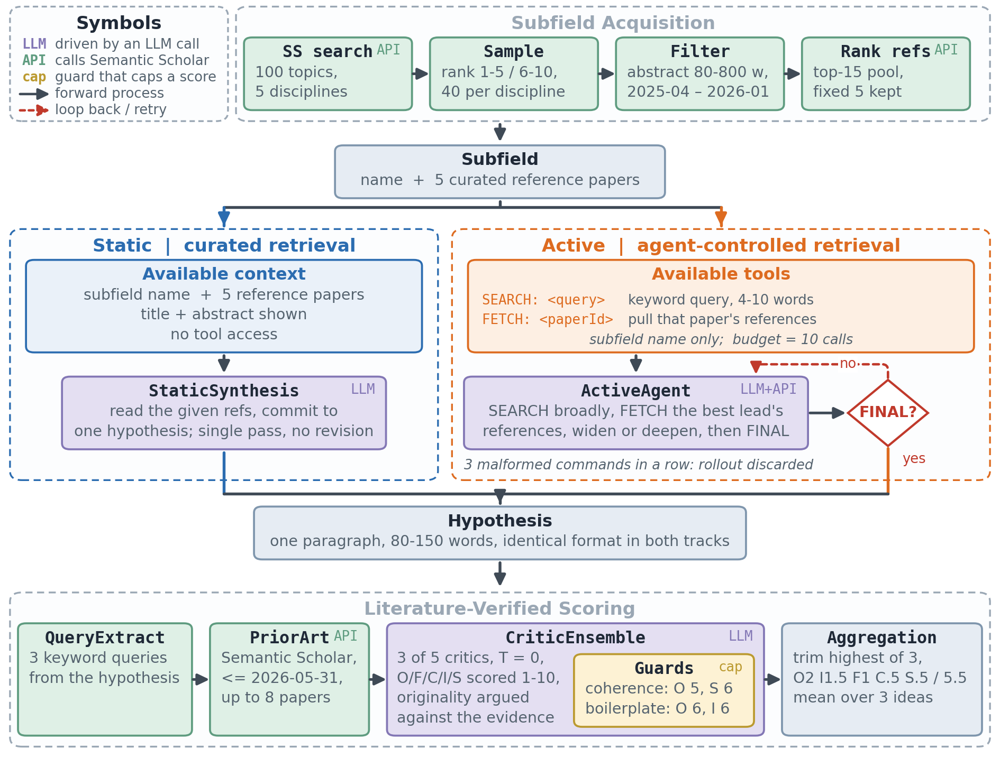
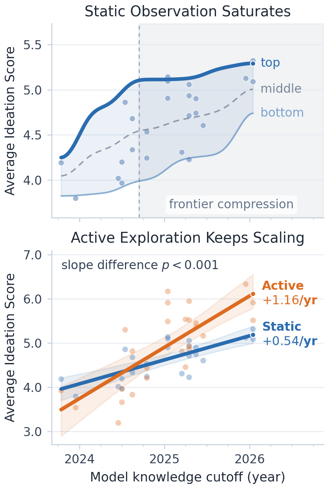
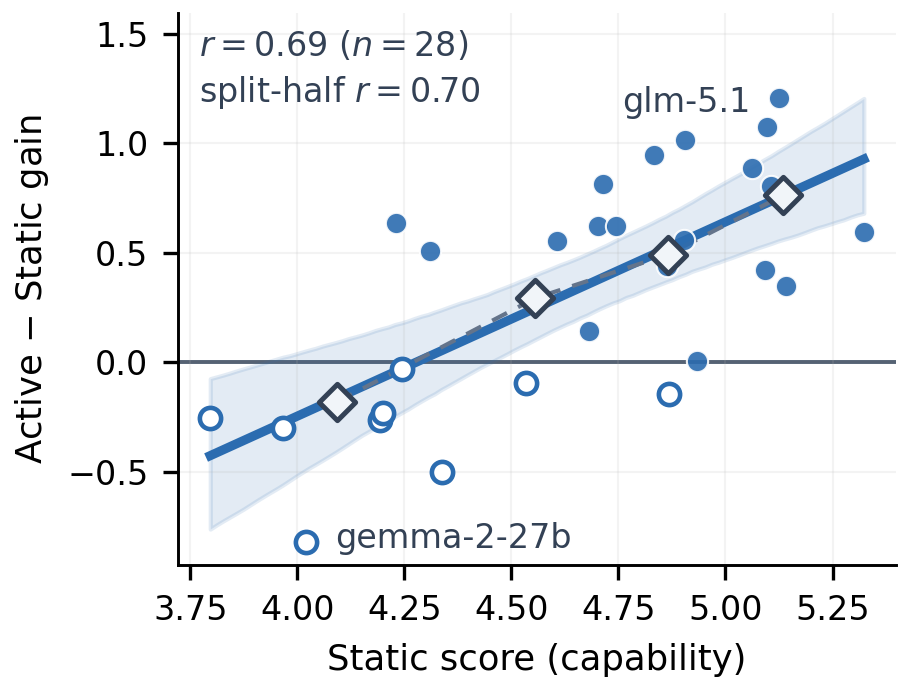
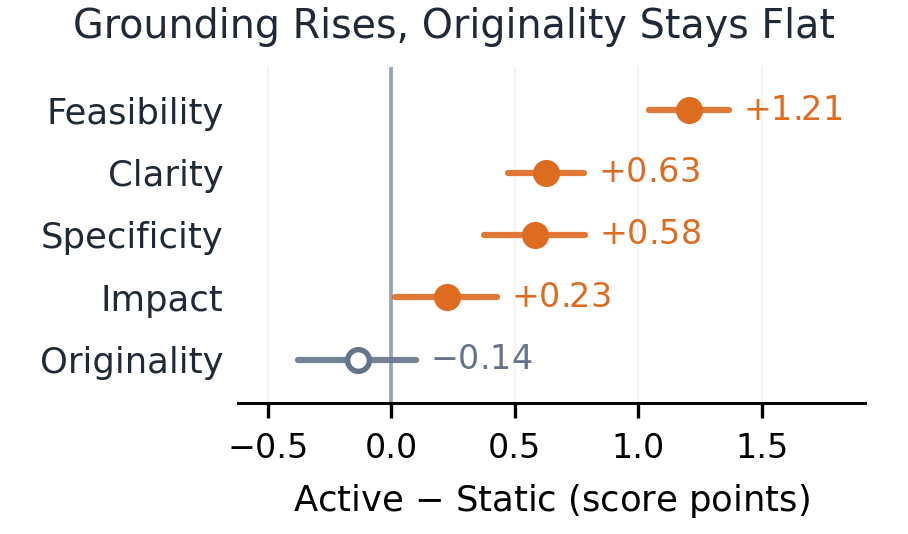

<div align="center">

# AgentIdeaBench

**Benchmarking Scientific Ideation in the Agent Era**

[](https://arxiv.org/abs/2609.07611)
[](LICENSE)
[](LICENSE-DATA)
[](pyproject.toml)
[](#leaderboard)
[](#how-the-benchmark-works)

[**Paper**](https://arxiv.org/abs/2609.07611) ·
[**Leaderboard**](#leaderboard) ·
[**Quickstart**](#quickstart) ·
[**Evaluate your model**](#evaluate-your-own-model) ·
[**Data**](#released-data) ·
[**Data Card**](DATA_CARD.md) ·
[**Cite**](#citation)

</div>

Benchmarks for scientific ideation hand a model a curated reference set and ask for the
hypothesis those references lead to. Real AI scientists do not work that way, and that
protocol is running out of room: across three model generations the top of the static
range has stopped moving.

**AgentIdeaBench** measures ideation under two matched settings. **Static** gives a model
the references. **Active** gives it a subfield name and a literature search tool, and lets
it decide what to look up, when to stop, and what to propose. Same subfields, same output
format, same critics — the only difference is who controls retrieval.

<div align="center">
<br>
<sub><b>One task set, two literature-access protocols, one literature-verified critic.</b> Schematic; no measured quantity appears.</sub>
</div>

Over 33 matched models and 40 densely scored subfields:

| | |
|---|---|
| **Active re-separates what Static compresses.** | Active carries **4.4×** the between-model score variance of Static (95% CI [3.5, 5.2]). Among top-half model pairs, Active distinguishes **62%** against Static's **12%**. |
| **The gain is capability-gated, not universal.** | Active − Static correlates with static ability at **r = +0.69** (*p* < 10⁻⁴, n = 28). The weakest quartile *loses* 0.18 from being handed tools; the strongest gains 0.76. |
| **Active scales about twice as fast.** | Against knowledge cutoff, **+1.16/yr** under Active versus **+0.54/yr** under Static, and Active is steeper in all five disciplines. |

---

## What's new

- **2026-09-11** — Code, `release_data/` (51 tables, ~436k rows), and [`DATA_CARD.md`](DATA_CARD.md) released.
- **2026-09-07** — Paper on [arXiv:2609.07611](https://arxiv.org/abs/2609.07611).

---

## Contents

[Why active exploration](#why-active-exploration) ·
[Leaderboard](#leaderboard) ·
[Quickstart](#quickstart) ·
[Evaluate your own model](#evaluate-your-own-model) ·
[How the benchmark works](#how-the-benchmark-works) ·
[Scoring](#scoring) ·
[Released data](#released-data) ·
[Reproducing the paper](#reproducing-the-paper) ·
[Repository layout](#repository-layout) ·
[Licensing](#licensing-and-responsible-use) ·
[Citation](#citation)

---

## Why active exploration

<div align="center">

</div>

**Top.** Static ideation scores against model knowledge cutoff. The top of the range
flattens over the shaded recent-cutoff region: newer frontier models are no longer pulling
away from each other when the references are handed to them.

**Bottom.** Both protocols improve with cutoff, but Active improves about twice as fast.
The measurement that saturates and the measurement that keeps resolving are run on the same
subfields, in the same output format, through the same critics.

An agentic protocol is not automatically a better one, so the paper also asks what could
make it a worse one — and the answers are all in this repo as runnable experiments: a
[budget sweep](#reproducing-the-paper) showing 10 tool calls is not a tuned advantage,
a replay control separating *what* Active retrieves from *that* it retrieved it, a
recall-only control, and a critic-validity check against rewritten landmark papers.

---

## Leaderboard

Weighted totals for the 33 matched models, ranked by Active. Δ = Active − Static.
**Turns** is the mean number of `SEARCH`/`FETCH` calls an Active rollout issues out of a
budget of 10; it describes behavior, not quality. Held-out closed-source models are marked
† and are excluded from every headline statistic.

| # | Model | Static | Active | Δ | Turns |
|--:|---|--:|--:|--:|--:|
| 1 | GLM-5.1 | 5.13 | **6.33** | **+1.21** | 8.8 |
| 2 | Gemini-3 Flash † | 5.59 | 6.29 | +0.70 | 8.5 |
| 3 | Gemini-3.5 Flash † | 5.87 | 6.22 | +0.35 | 9.9 |
| 4 | Gemini-3.1 Pro † | 5.63 | 6.20 | +0.57 | 7.5 |
| 5 | Kimi-K2.6 | 5.10 | 6.17 | +1.08 | 9.8 |
| 6 | Qwen3.5 397B | 5.06 | 5.95 | +0.89 | 8.9 |
| 7 | Kimi-K2.5 | 4.91 | 5.92 | +1.02 | 9.9 |
| 8 | DeepSeek-V4 Pro | **5.32** | 5.92 | +0.60 | 8.5 |
| 9 | MiMo-V2.5 Pro | 5.11 | 5.91 | +0.81 | 9.0 |
| 10 | GLM-4.6 | 4.83 | 5.78 | +0.95 | 6.9 |
| 11 | Qwen3.5 27B | 4.71 | 5.53 | +0.82 | 8.0 |
| 12 | DeepSeek-V4 Flash | 5.09 | 5.52 | +0.42 | 9.0 |

<details>
<summary><b>Full table — all 33 models, with per-dimension Active scores</b></summary>

<br>

Per-dimension columns are Originality, Feasibility, Clarity, Impact, Specificity, each a
3-hypothesis × 40-subfield mean after dropping the most generous of three critics.
Bold marks the best open-weight value per column.

| Model | Static | Active | Δ | Turns | Orig. | Feas. | Clar. | Impact | Spec. |
|---|--:|--:|--:|--:|--:|--:|--:|--:|--:|
| GLM-5.1 | 5.13 | **6.33** | **+1.21** | 8.8 | **6.31** | 6.32 | **7.37** | **5.90** | **6.71** |
| Gemini-3 Flash † | 5.59 | 6.29 | +0.70 | 8.5 | 6.33 | 6.16 | 7.12 | 5.92 | 6.60 |
| Gemini-3.5 Flash † | 5.87 | 6.22 | +0.35 | 9.9 | 6.09 | 6.51 | 7.21 | 5.77 | 6.56 |
| Gemini-3.1 Pro † | 5.63 | 6.20 | +0.57 | 7.5 | 6.20 | 6.14 | 7.14 | 5.83 | 6.47 |
| Kimi-K2.6 | 5.10 | 6.17 | +1.08 | 9.8 | 6.08 | 6.38 | 7.22 | 5.70 | 6.53 |
| Qwen3.5 397B | 5.06 | 5.95 | +0.89 | 8.9 | 5.79 | 6.28 | 6.81 | 5.57 | 6.19 |
| Kimi-K2.5 | 4.91 | 5.92 | +1.02 | 9.9 | 5.84 | 6.00 | 6.86 | 5.58 | 6.17 |
| DeepSeek-V4 Pro | **5.32** | 5.92 | +0.60 | 8.5 | 5.79 | 5.94 | 7.14 | 5.53 | 6.35 |
| MiMo-V2.5 Pro | 5.11 | 5.91 | +0.81 | 9.0 | 5.63 | 6.46 | 6.97 | 5.46 | 6.26 |
| GLM-4.6 | 4.83 | 5.78 | +0.95 | 6.9 | 5.64 | 6.14 | 6.84 | 5.31 | 5.99 |
| Qwen3.5 27B | 4.71 | 5.53 | +0.82 | 8.0 | 5.27 | 5.82 | 6.64 | 5.22 | 5.83 |
| DeepSeek-V4 Flash | 5.09 | 5.52 | +0.42 | 9.0 | 5.14 | 6.16 | 6.70 | 5.09 | 5.82 |
| Gemma-4 31B | 5.14 | 5.49 | +0.35 | 5.0 | 5.22 | 6.05 | 6.78 | 4.97 | 5.75 |
| MiMo-V2.5 | 4.90 | 5.46 | +0.56 | 7.8 | 5.14 | 6.05 | 6.35 | 5.17 | 5.55 |
| Mistral Medium 3.1 | 4.74 | 5.37 | +0.62 | 6.7 | 5.00 | 5.82 | 6.52 | 5.08 | 5.63 |
| MiniMax-M2.7 | 4.70 | 5.33 | +0.62 | 9.7 | 4.95 | 6.03 | 6.47 | 4.91 | 5.50 |
| DeepSeek-R1 | 4.86 | 5.30 | +0.44 | 6.0 | 5.08 | 5.50 | 6.49 | 4.95 | 5.68 |
| Mistral Small 2603 | 4.61 | 5.16 | +0.55 | 9.4 | 4.65 | 5.93 | 6.60 | 4.72 | 5.55 |
| Gemini-2.5 Flash † | 5.10 | 5.05 | −0.05 | 7.7 | 4.53 | 6.07 | 6.01 | 4.78 | 4.92 |
| Qwen3 30B | 4.93 | 4.94 | +0.01 | 8.3 | 4.49 | 5.65 | 6.17 | 4.58 | 5.18 |
| Qwen3.5 9B | 4.23 | 4.87 | +0.64 | 6.9 | 4.75 | 4.90 | 6.03 | 4.53 | 5.13 |
| Gemma-3 27B | 4.68 | 4.82 | +0.14 | 6.2 | 4.16 | 6.34 | 6.09 | 4.21 | 5.02 |
| GLM-4.5 Air | 4.31 | 4.82 | +0.51 | 8.9 | 4.49 | 5.60 | 5.56 | 4.59 | 4.56 |
| Qwen3 Coder | 4.87 | 4.72 | −0.15 | 8.6 | 3.82 | 6.55 | 6.15 | 4.14 | 5.02 |
| Qwen3 32B | 4.53 | 4.44 | −0.10 | 3.1 | 4.13 | 5.04 | 5.31 | 4.15 | 4.46 |
| Gemini-2.5 Flash-Lite † | 4.63 | 4.27 | −0.37 | 6.9 | 3.20 | 6.71 | 5.47 | 3.70 | 4.15 |
| Qwen3 8B | 4.24 | 4.21 | −0.03 | 4.3 | 3.84 | 5.10 | 4.95 | 3.90 | 4.13 |
| Qwen2.5 72B | 4.20 | 3.97 | −0.23 | 8.8 | 2.67 | 6.77 | 5.33 | 3.37 | 3.96 |
| Mistral Small 24B | 4.19 | 3.93 | −0.26 | 8.9 | 2.88 | 6.25 | 5.01 | 3.48 | 3.82 |
| Llama-4 Maverick | 4.34 | 3.84 | −0.50 | 4.5 | 2.63 | **6.87** | 4.77 | 3.23 | 3.47 |
| Qwen2.5 7B | 3.97 | 3.67 | −0.30 | 8.8 | 2.62 | 6.12 | 4.45 | 3.28 | 3.31 |
| Llama-3.1 8B | 3.80 | 3.54 | −0.26 | 6.7 | 2.65 | 5.66 | 4.11 | 3.29 | 3.06 |
| Gemma-2 27B | 4.02 | 3.20 | −0.82 | 4.1 | 2.26 | 5.60 | 3.90 | 2.75 | 2.75 |

Weighted total is `O:2, I:1.5, F:1, C:0.5, S:0.5` normalized by 5.5, under the `lit8d`
critic. An extended roster of 63 paired models is in Appendix E of the paper; row-level
scores for every model are in [`release_data/`](#released-data).

</details>

**Two patterns worth reading off the table.** The dimensions do not move together:
originality and impact climb toward the frontier, while feasibility peaks on a *weak*
model — Llama-4 Maverick at 6.87. And Δ is far from uniform: 19 of 28 open-weight models
improve, the strongest by over a point, while several weak models are actively hurt.

<div align="center">

</div>

Handing a weak model a search tool does not make it a better scientist. It gives it more
ways to go wrong.

**What the gain is made of.** Splitting Δ by dimension over the 28 matched models, agent-
controlled retrieval buys grounding, not invention: feasibility, clarity and specificity
rise, while measured originality does not move.

<div align="center">

</div>

Read that as a property of *this* critic as much as of the models: originality here is
scored against retrieved prior art, and better retrieval improves how well a hypothesis is
argued without changing how new it is. A benchmark that scored originality from a judge's
memory would likely report a different split.

---

## Quickstart

```bash
git clone https://github.com/HKUST-KnowComp/AgentIdeaBench.git
cd AgentIdeaBench
pip install -r requirements.txt
cp .env.example .env          # then fill in your keys
```

```bash
OPENROUTER_API_KEY=sk-or-...      # required: open-weight generation + critics + pairwise
OPENROUTER_US_API_KEY=sk-or-...   # required: routes OpenAI / Anthropic / Google models
SEMANTIC_SCHOLAR_API_KEY=...      # optional but recommended (Phase 1-A + dynamic_search judge)
```

`config.py:is_us_key_model` routes OpenAI, Anthropic and Google traffic to the US key
automatically; everything else uses the default key.

Then, smallest end-to-end run — build a small task set, generate under both protocols,
score, and rank:

```bash
python run.py --phase 1                                   # build the task set
python run.py --phase 2 --smoke --model qwen/qwen3-30b-a3b-instruct-2507
python run.py --phase 2 --smoke --model qwen/qwen3-30b-a3b-instruct-2507 --active
python run.py --phase 3 --smoke                           # 3 critics × 5 dimensions
python run.py --phase 4                                   # aggregate → reports/leaderboard.md
```

Phases 2, 3 and 5 skip rows already in the database, so killing and restarting a run is
safe. Generation runs at temperature 0.7, scoring at 0.0, both at seed 42.

> **Note** — no API keys and just want the numbers? Every hypothesis, score and retrieval
> trace behind the paper is in [`release_data/`](#released-data). Nothing below needs to be
> re-run to reproduce a published figure.

---

## Evaluate your own model

Any model reachable through OpenRouter can be scored under the identical protocol.

**1.** Add the model id to `config.json`:

```jsonc
"models": {
  "idea_models": [ "...", "your-org/your-model" ]
}
```

**2.** Generate under both protocols. Both write to `data/results.db`:

```bash
python run.py --phase 2 --model your-org/your-model            # Static
python run.py --phase 2 --model your-org/your-model --active   # Active
```

**3.** Score and rank. Phase 3 picks up any unscored hypothesis, so it needs no arguments:

```bash
python run.py --phase 3
python run.py --phase 4
```

Your model lands in `reports/leaderboard.md` alongside the published roster, measured the
same way. A few things to keep in mind if you intend to compare against the numbers above:

- **Keep the critics fixed.** The published totals use `qwen/qwen3.6-plus`,
  `moonshotai/kimi-k2.6` and `z-ai/glm-5.1`. Changing the critic ensemble changes the scale.
- **Prior art is frozen at 2026-05-31.** That single global idea-conception date is what
  makes scores comparable across model generations, and it filters strictly more
  aggressively for older models.
- **Active needs a working tool loop.** A model that cannot emit `SEARCH`/`FETCH`/`FINAL`
  reliably will have rollouts discarded after three malformed commands in a row. That is a
  measured property, not a bug — but check `results.db` telemetry before reading the score.

Submitting a result to the leaderboard: open a PR editing this README's table, with the
`results.db` rows or a `release_data`-shaped export attached so the numbers can be checked.

---

## How the benchmark works

**The task set.** 100 subfields across CS, Biology, Physics, Chemistry and Medicine, built
from Semantic Scholar search over papers published 2025-04-01 to 2026-01-31, stratified
across result ranks 1–5 and 6–10 so the set is not purely the most-cited work. Each subfield
keeps 5 fixed reference papers drawn from an embedding-ranked top-15 pool. 40 subfields are
densely scored at 3 hypotheses per cell, and those 40 back every reported statistic.

**The two protocols.**

| | Static (Track B) | Active (Track C) |
|---|---|---|
| Model sees | subfield + 5 deterministically shuffled references | subfield name only |
| Tools | none | `SEARCH: <query>` · `FETCH: <paperId>` |
| Retrieval path | fixed by us | chosen by the model |
| Loop | single pass, no revision | up to 10 calls, then `FINAL` |
| Output | one-paragraph hypothesis, 80–150 words | one-paragraph hypothesis, 80–150 words |
| Recorded | — | every query, tool call and returned paper id |

The 10-call budget is not tuned for advantage. A sweep over {1, 2, 5, 10, 15, 20} calls on
five backbones finds no backbone gaining between 5 and 10, and the five-backbone mean moves
+0.04 from budget 10 to 20 against a between-backbone spread of 0.52 (paired *t*, n = 5,
all *p* ≥ 0.78).

<details>
<summary><b>The five pipeline phases</b></summary>

<br>

| Phase | Step | Entry point | Output |
|---|---|---|---|
| 1-A | Semantic Scholar search + stratified sampling | `data_collection/fetch_ss_search.py` | `papers.db` raw rows |
| 1-B | quality filter (abstract length, pub type, date, ref count) | `data_collection/filter_papers.py` | `status=filtered` |
| 1-C | rewrite abstract → `gt_hypothesis` | `data_collection/prepare_context.py` | `papers.gt_hypothesis` |
| 1-D | pick 5 fixed refs + top-15 candidate pool by embedding | `data_collection/embed_references.py` | `papers.ranked_refs_json` |
| 2 | Static generation | `generation/generate_ideas.py` | `results.db` ideas |
| 2 | Active generation | `generation/active_agent.py` | `results.db` ideas + telemetry |
| 3 | 5-dimension critic scoring | `evaluation/critic_manager.py`, `absolute_scorer.py` | `results.db` scores |
| 4 | trimmed-mean aggregation + leaderboard | `analysis/compute_scores.py`, `leaderboard.py` | `reports/leaderboard.{md,json}` |
| 5 | pairwise comparison + Bradley–Terry | `evaluation/pairwise_manager.py`, `analysis/pairwise_aggregate.py` | `reports/pairwise.{md,json}` |

```bash
python run.py --phase 1                              # full Phase 1
python run.py --phase 2 --smoke                      # Static generation
python run.py --phase 2 --smoke --active             # Active generation
python run.py --phase 3 --smoke                      # critic scoring
python run.py --phase 3 --judge-mode dynamic_search  # critic-time retrieval
python run.py --phase 4                              # aggregate + leaderboard
python run.py --phase 5                              # pairwise (needs phase 4 first)
```

</details>

---

## Scoring

Each hypothesis is scored 1–10 on **Originality, Feasibility, Clarity, Impact,
Specificity** against an anchored scale.

**Originality is argued against retrieved prior art, not against the critic's memory.**
Before scoring, three keyword queries are extracted from the hypothesis and up to eight
prior-art papers are retrieved from Semantic Scholar, filtered to publications on or before
**2026-05-31** — one global idea-conception date for every model. That evidence is frozen in
the `e13_evidence` table, so a critic call is reproducible after the fact.

Three guards run alongside the rubric, so that a hypothesis cannot score well by sounding
like one:

| Guard | Catches | Effect |
|---|---|---|
| Coherence Check | keyword stuffing, incoherent text | caps Originality ≤ 5, Specificity ≤ 6 |
| Factual Consistency Check | hallucinated facts | flags and penalizes |
| Boilerplate Check | generic ML-proposal template | caps Originality ≤ 6, Impact ≤ 6 |

Three critics score every hypothesis. Per dimension we take a **trimmed mean that drops the
single most generous of the three** and averages the rest, then weight `O:2, I:1.5, F:1,
C:0.5, S:0.5` and normalize by 5.5. Parsing failures are 233 of 20,826 critic calls (1.1%);
failed calls are retried, never silently dropped.

<details>
<summary><b>Sanity baselines and prior-knowledge probes</b></summary>

<br>

`baselines/generate_baselines.py` produces four controls. The expected ordering is
`random < template < copy < gt < real models`.

| Baseline | How | Tests |
|---|---|---|
| `random` | domain keywords shuffled into a paragraph | floor |
| `template` | fixed template with the domain inserted | is fluency alone rewarded? |
| `copy` | a reference abstract rewritten into hypothesis form | can the critic tell repackaged prior work from a new idea? |
| `gt` | the paper's own abstract rewritten | upper-bound oracle |

`copy` is the load-bearing one.

Two recitation probes ask whether the benchmark measures ideation or training-set coverage:

```bash
python experiments/prior_probe.py --corpus testset   # can the model recite a test paper's abstract?
python experiments/prior_probe.py --corpus refs      # ... or one of the references'?
python experiments/prior_probe_correlate.py
python experiments/prior_probe_refs_analyze.py
```

Both write to `results.db` (`prior_probe`, `prior_probe_refs`). The analysers report
per-model `claim%`, `acc_when_claimed`, a composite, by-year buckets, and correlations
against static score.

</details>

---

## Released data

[`release_data/`](release_data/) holds the generated hypotheses, every critic score, the
retrieval traces, and the derived statistics behind the paper — **51 files, ~436k rows,
39 MB** gzipped CSV.

```
release_data/
├── MANIFEST.json     # per-file rows, bytes, sha256, source table, dropped columns
├── core/             # tables backing the main results
├── appendix/         # tables backing the appendix experiments
└── derived/          # reference lists, retrieval traces and evidence, as identifiers
```

```python
import pandas as pd
ideas  = pd.read_csv("release_data/core/subdomain_ideas.csv.gz")      # 26,098 hypotheses
scores = pd.read_csv("release_data/core/lit8d_scores_3seed.csv.gz")   # 47,013 critic scores
traces = pd.read_csv("release_data/derived/active_traces.csv.gz")     # every Active tool call
```

`derived/active_traces.csv.gz` is the one to look at first if you care about agent behavior:
every query an Active rollout issued, in order, with the paper ids it got back. It is what
the Turns column is computed from, and it is enough to ask what a *good* search trajectory
looks like without re-running anything.

**What the release does not carry**, and why, is the subject of [`DATA_CARD.md`](DATA_CARD.md).
In short: no abstracts, no reference-list text, no full text, and no text generated by the
Gemini models. Those boundaries are machine-checked rather than asserted:

```bash
python scripts/export_release_data.py --verify-only
```

re-reads all 51 products and asserts five properties — no dropped column survived, no
unwhitelisted long text, no abstract shingle in any assembled field, no Gemini-generated
text, and every sha256 matches `MANIFEST.json`. It exits non-zero on any failure.

---

## Reproducing the paper

Every figure and table in the paper is generated by a script in `reports/`, and the derived
statistics those scripts read ship with this repo. For eight of the nine figures **no API key
and no database are needed** — a fresh clone rebuilds them directly:

```bash
python reports/_fig1_two_panel.py        # → reports/figures/summary/fig1_static_active_cutoff.png
#   primary roster rows          30
#   panel B  Static n=24  slope +0.5436/yr   (paper +0.54)
#   panel B  Active n=26  slope +1.1617/yr   (paper +1.16)
```

Each script prints the published values it is reproducing, so a mismatch is visible in the
run rather than only in the rendered figure.

| Paper asset | Script | Reads |
|---|---|---|
| Saturation + cutoff scaling | `reports/_fig1_two_panel.py` | `e22_new_axis_stats.json`, `e30_review_stats.json` |
| Benchmark overview | `reports/_fig2_overview.py` | `config.json` — schematic, no measured data |
| Capability gate | `reports/_gate_single_v2.py` | `e22_new_axis_stats.json`, `e37_review_r2_stats.json` |
| Per-discipline slopes | `reports/_fig_domain_slopes.py` | pinned pre-E42 `e23_ablations.json` snapshot |
| Per-dimension deltas | `reports/_fig_perdim_deltas.py` | `e39_perdim_ci.json` |
| Idea diversity | `reports/_fig_diversity_v2.py` | `e28_idea_diversity.json` |
| Per-discipline critic validity | `reports/_fig_domain_validity.py` | `e40_domain_validity.json` |
| Gain decomposition | `reports/_fig_gain_decomposition.py` | `e38_replay_refs.json`, `e32_recall_only.json` |
| Tool-call budget sweep | `reports/_fig_turn_budget.py` | `data/results.db` |
| Leaderboard table | `reports/_make_paper_leaderboard.py` | `data/results.db` |
| Headline statistics | `reports/_stats_analysis.py` | `data/results.db` |

The three `results.db` consumers are the exception: they aggregate from the raw scoring
rows, which are released as `release_data/core/lit8d_scores_3seed.csv.gz` rather than as a
database file. Everything else runs from the JSON stats artifacts shipped in `reports/`.

Those artifacts are pinned deliberately. `_fig_domain_slopes.py`, for instance, reads an
archived pre-2026-08-30 snapshot rather than the live file, because the live one was later
recomputed over a roster that includes closed-source models the paper holds out. Each
script's docstring says which snapshot it reads and why.

---

## Repository layout

```
AgentIdeaBench/
├── run.py                      # main entry (--phase 1..5)
├── config.py / config.json     # parameters; config.py also routes to the US key
├── data_collection/            # Phase 1 (A/B/C/D)
├── generation/                 # Phase 2, Static + Active + Scientific World Modeling
├── baselines/                  # four sanity-check baselines
├── evaluation/                 # Phase 3 critic, Phase 5 pairwise, dynamic judge
├── analysis/                   # Phase 4 aggregation, leaderboard, Bradley–Terry
├── experiments/                # probes, sweeps, ablations, controls
├── reports/                    # figure + statistics scripts, and the stats they read
├── scripts/                    # release export + operational helpers
├── utils/                      # LLM wrapper (routing + backoff), constants, db_init
├── release_data/               # the public release (see DATA_CARD.md)
├── assets/                     # figures used by this README
└── data/                       # gitignored: papers.db + results.db, built by Phase 1
```

---

## Licensing and responsible use

Two licenses, because the code and the data carry different obligations.

| What | License | File |
|---|---|---|
| Code: pipeline, critic prompts, analysis and figure scripts | MIT | [`LICENSE`](LICENSE) |
| Data: generated hypotheses, critic scores, derived statistics, retrieval identifiers | CC BY 4.0 | [`LICENSE-DATA`](LICENSE-DATA) |

Three things are **not** redistributed here:

- **Paper abstracts, reference lists, and full texts.** The Semantic Scholar API License
  Agreement does not grant redistribution rights for publisher-sourced content. The release
  carries Semantic Scholar identifiers, query strings and retrieval timestamps only; refetch
  the text yourself under your own API agreement. Academic Graph metadata is ODC-BY 1.0 and
  Semantic Scholar is attributed as required.
- **Text generated by the Gemini models.** The Gemini API additional terms assign ownership
  of generated output to the developer while forbidding the use of that output to build or
  improve a competing model, so releasing that text under CC BY 4.0 would purport to grant
  rights we do not hold. For those models the release carries scores, per-dimension
  breakdowns and derived statistics only; the text fields hold a placeholder.
- **Model weights.** None. Each model stays under its own license: Apache-2.0 (qwen, mistral
  small), MIT (deepseek, z-ai, xiaomi), Modified MIT (moonshot; minimax, whose commercial use
  additionally needs written authorization), the Gemma Terms of Use, and the Llama Community
  License. `mistral-medium-3.1` is a premier API model with no public weights; it stays in
  the roster because it is scored under the same protocol, not because it is redistributable.

**Intended use** is research on evaluating and improving language-model ideation. This is not
a validated instrument for deciding what science to fund or publish. The hypotheses in this
release are untested model output, scored by other models, and nothing here has been checked
by a domain expert for correctness.

---

## Citation

```bibtex
@article{mo2026agentideabench,
  title   = {AgentIdeaBench: Benchmarking Scientific Ideation in the Agent Era},
  author  = {Mo, Yunxiang and Zheng, Tianshi and Gao, Yisen and Wang, Rui and
             Nam, Newt Nguyen Kim Hue and Tam, Kelvin Kiu Wai and Bai, Jiaxin and
             Song, Yangqiu and Wong, Ginny and See, Simon},
  journal = {arXiv preprint arXiv:2609.07611},
  year    = {2026},
  url     = {https://arxiv.org/abs/2609.07611}
}
```

---

## Acknowledgements

Built at [HKUST KnowComp](https://github.com/HKUST-KnowComp). Paper metadata and prior-art
retrieval come from the [Semantic Scholar Academic Graph](https://www.semanticscholar.org/product/api);
model access is routed through [OpenRouter](https://openrouter.ai).

Questions, corrections, and leaderboard submissions are welcome as
[issues](https://github.com/HKUST-KnowComp/AgentIdeaBench/issues) or pull requests.
